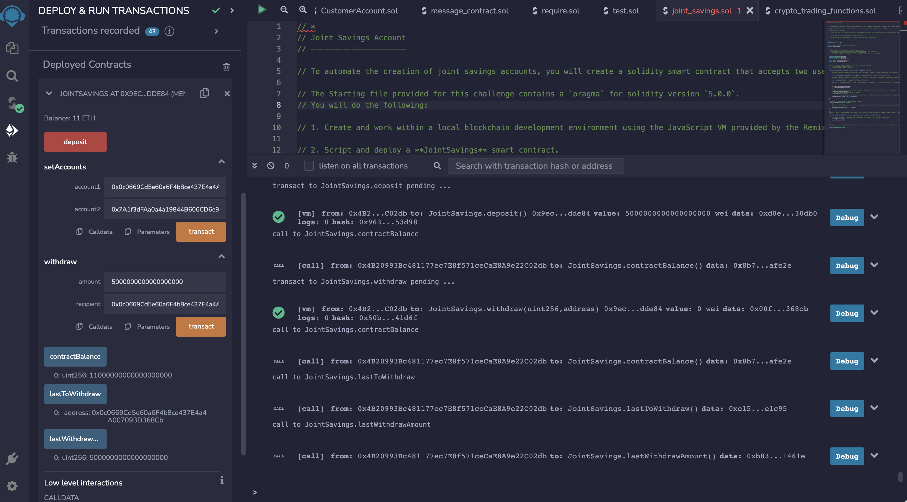

# Joint_Savings
The objective of this excercise is to automate the creation of joint savings accounts, It is done by creating a Solidity smart contract that accepts two user addresses which will control a joint savings account.
It uses ether management functions that enables depositing and withdrawing funds from the accounts.

It is done by following these 3 steps:
1) Creating  a Joint Savings Account Contract in Solidity
2) Compiling and deploying the Contract in the JavaScript VM
3) Interacting with the Deployed Contract

## Results
1) Testing setAccounts function: 
    
2) Testing deposit function:  
  Deposit 1 eth:
   
  Deposit 10 eth:
   
  Deposit 5 eth:
   
3) Testing the withdrawal functionality of the smart contract:  
   Withdraw 5 eth from Account 1:
   
   Withdraw 10 eth from Account 2:
   
